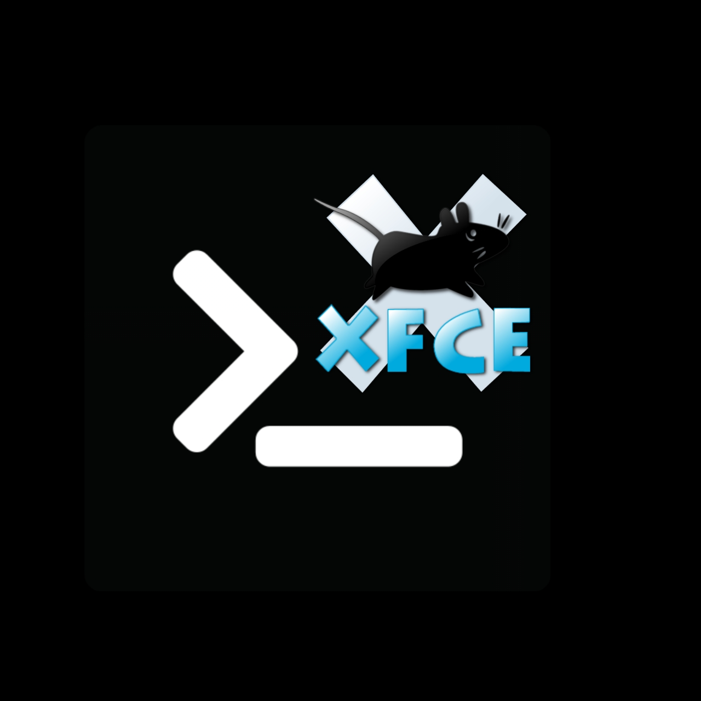

  

# About  
Hai all 🤗, may i introduce myself and this project.  
• Name of author: [Almer K.](github.com/Kklmfir)  
• Date build: 28 December 2021  
Allright, these are just some **[Xfce4](xfce.org/)** as a desktop enviroment and **[Gtk](pling.com/)** as a themes in this project, would be help you to get a graphical enviroment in the [termux](https://f-droid.org/en/packages/com.termux/)
  ## Documentation  
  ## Installation  
  ## System Minimum Requirement  
System recomedation from me to install xfce4 in termux are:  
• 1 GB RAM  
• 1,5 GB storage  
# Preview
  ## Desktop
  ## Apps
  ## Tools
# Sources
  ## [Wallpapers](wallpaperflare.com/)
  ## [Themes](https://www.pling.com/browse?cat=567&tag=gtk)
  ### Icons
  ### Gtk themes
